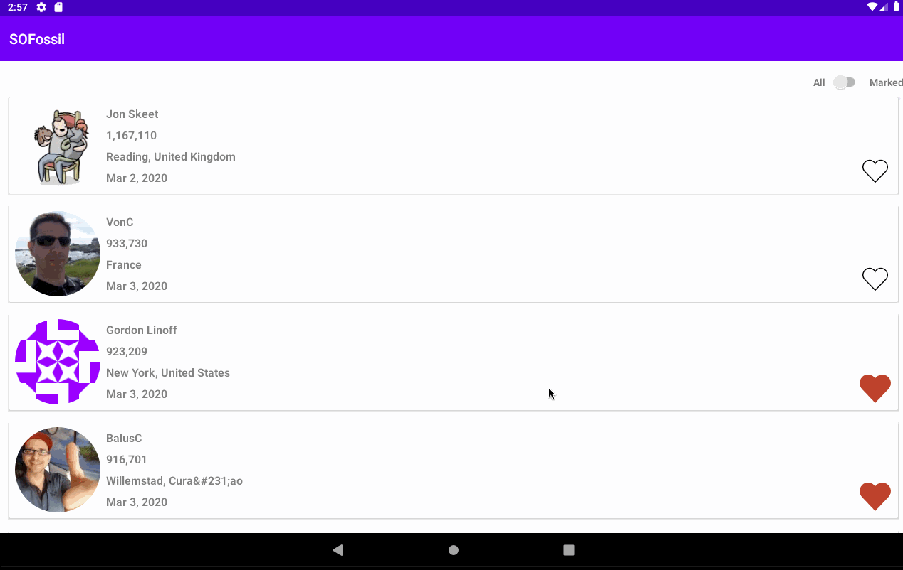

# StackOverow 
- This project demonstrate how to integrate paging into your project

## Description
- HomeScreen: load all user from StackOverflow with infinite scroll. Toggle All/Marked to select all user or bookmarked users.
Support save offline for user
- DetailScreen: could select one user from home to show detail reputation of user

## Architecture
- Apply clean architecture
- MVVM

## Libraries
- Koin for dependencies injection
- Retrofit
- Moshi
- Coroutine
- Navigation
- Paging + BoundaryCallback
- Room

## Demo 

